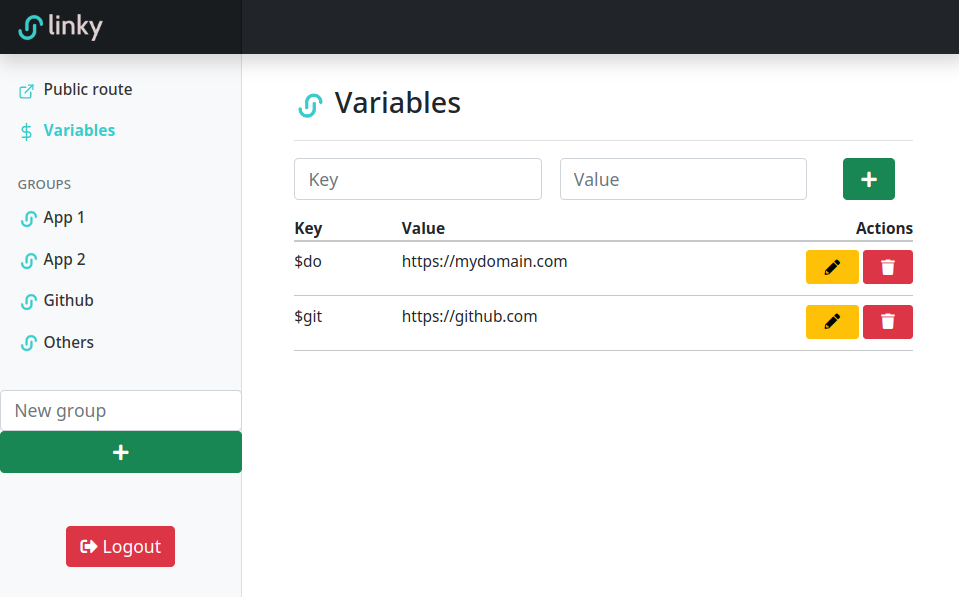
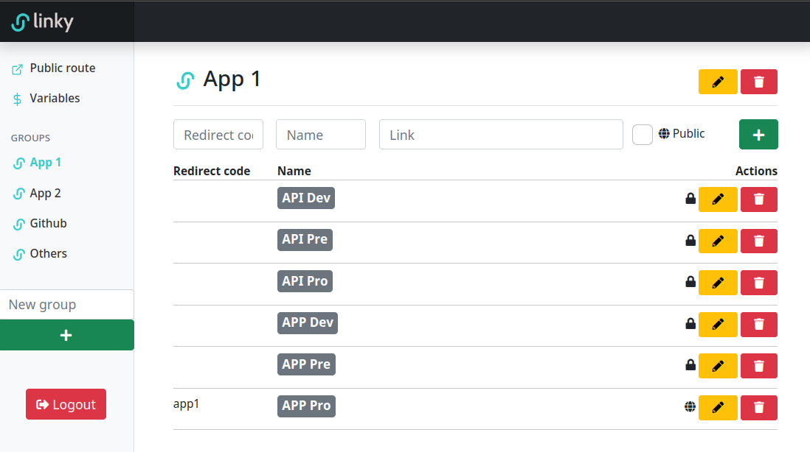
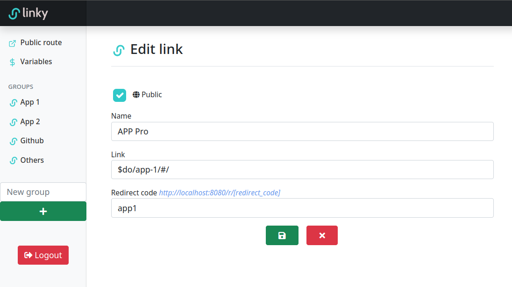
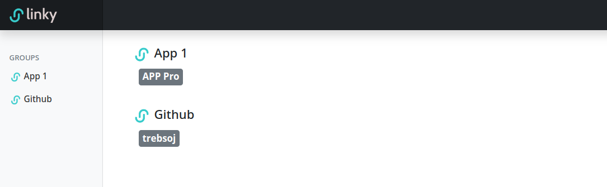

<p align="center">
  
</p>

**Application to manage your personal or your organization links in a grouped and orderly way.**







Public route:



# Features list
- For local application running, you need just two dependencies - installed `docker` and `docker-compose` (`make` is optional, but strongly recommended)
- Application built with Laravel PHP + bootstrap + mysql + nginx
- One only user (admin)
- /public route to see the links marked as public (without login)
- Create link groups
- Create variables for the links
    - For example, we can save the domain https://github.com domain as `$git`, so all the links that refer to this domain, we will only have to save the link as: `$git/trebsoj`.
- If a link has the "Redirect code" field configured, it can be accessed directly with the URL and you will be redirected to the destination.    
# How to use

**1. Clone repository**
```shell
$ git clone https://github.com/trebsoj/home-app.git
```

**2. Configuration file**

Creation of the configuration file from the example .env.example,
in this file you can configure the database parameters and the application port

```shell
$ cp .env.example .env
```

**3. Start the application**

```shell
$ make up
```

3.1. If it is the **first execution**, execute this command to initialize the application

```shell
$ make init
```

# How to
### Open the shell in the container?

Execute in your terminal:

```shell
$ make sh-app
```
```shell
$ make sh-db
```
```shell
$ make sh-webserver
```

### Watch logs?

```shell
$ docker-compose logs -f
```

### Restart admin user?
- Connect to the database container

```shell
$ make sh-db
```

- Connect to mysql (Use credentials from the .env file)

```shell
$ mysql --host db -u {DB_USER} -p
```
- Enter de password {DB_PASSWORD}
- Truncate the users table
```shell
  truncate table home_app.users;
```
- Now when you enter the application again, it will ask you to re-register the admin user
